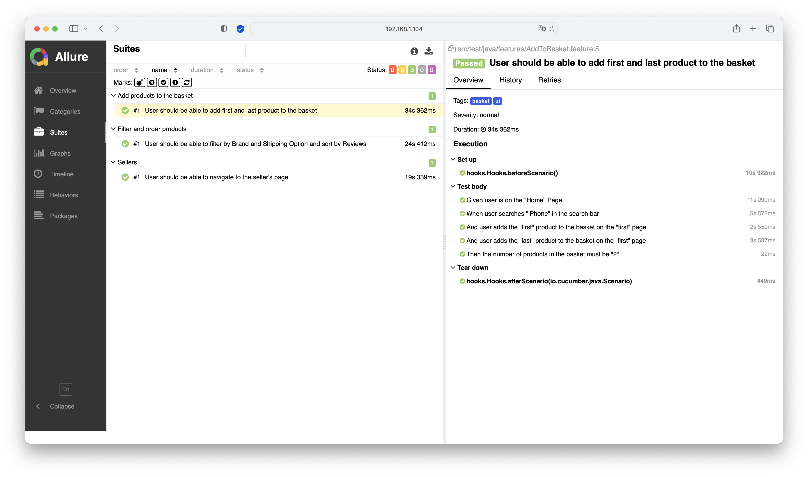

<div style="vertical-align:middle; text-align:center"> 
<h1> n11 Test Automation </h1>
</div>

## Overview
___

* The following test cases were automated in this project:

```
  Scenario: User should be able to navigate to the seller's page
    Given user is on the "Sellers" Page
    When user clicks to "Tüm Mağazalar" button
    And user clicks to the "S" letter to filter sellers
    And user clicks to a seller randomly
    Then user should see that navigated to the desired seller's page
```

```
  Scenario: User should be able to add first and last product to the basket
    Given user is on the "Home" Page
    When user searches "iPhone" in the search bar
    And user adds the "first" product to the basket on the "first" page
    And user adds the "last" product to the basket on the "first" page
    Then the number of products in the basket must be "2"
```

```
  Scenario: User should be able to filter by Brand and Shipping Option and sort by Reviews
    Given user is on the "Home" Page
    When user searches "telefon" in the search bar
    And user selects the "second" option from the "Marka" filter
    And user selects the "Yorum sayısı" option from the sort by menu
    And user selects the option as "Ücretsiz Kargo" from the "Kargo Seçenekleri" filter
    Then all of the products should have "Ücretsiz Kargo" badge
```

## Tools
___
The following tools were used while creating the test automation project:
* Selenium
* Cucumber
* TestNG
* Allure Report

## Project Architecture
___
* The project was created according to POM (Page Object Model).
* The **pages**, **popups**, **headers** and **banners** are located under the **models** package.

## Driver and Browser Management
___
In this project, Selenium Manager, which was first announced in Selenium version 4.6, was used. 
* Thanks to its **automated driver management** feature, Selenium Manager automatically downloads the required driver if it is unavailable. In this way, there is no need to do any driver pathing.
* Likewise, with its **automated browser management** feature, if the required browser is not available in the local system, it downloads it automatically.
* The details about Selenium Manager can be accessed from [this](https://www.selenium.dev/documentation/selenium_manager/) link.

## Running the Tests
___
* To run all of the test cases from command line, this command can be used:
```
mvn test
```
* The **@ui** tag was added to every test cases. **@basket**, **@filter** and **@sellers** tags were used according to test cases.
* To run the test cases by tags from the command line, the following command can be used:
```
mvn test -Dcucumber.filter.tags='@basket'
```

## Test Reports
* [**Allure Report**](https://allurereport.org) was used to create the test summary reports. Allure Report must be downloaded to use it. After the installation, the reports can be created with the following command:
```
allure serve
```
* When a test step was failed, a screenshot is taken and the screenshot is added to the test report.



